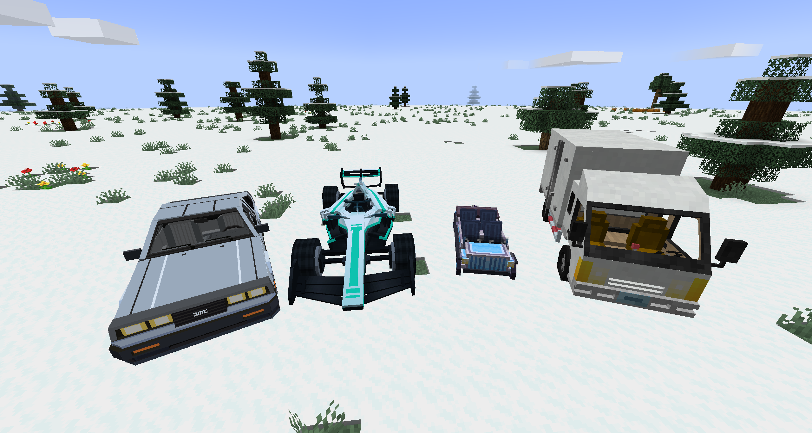

# RIAutomobility

<div align="center">

[](https://www.minecraft.net/)
[](https://files.minecraftforge.net/)
[](LICENSE.txt)

**A Forge addon for Automobility with new vehicles, multi-seat support, and an in-game Blockbench vehicle editor.**

[English](#english) | [中文](#中文)

</div>

---

## English

### Overview

RIAutomobility is an addon for Automobility on Minecraft 1.20.1. It adds built-in vehicle components, multi-seat vehicles, custom hitboxes and cameras, and a Vehicle Import Table for turning Blockbench projects into shareable vehicle components.

### Dependencies

| Mod | Version |
|-----|---------|
| Minecraft | `1.20.1` |
| Forge | `47.1.x` |
| [Automobility](https://www.curseforge.com/minecraft/mc-mods/automobility) | `0.4.2+1.20.1-forge` |

### Installation

1. Install Forge for Minecraft 1.20.1.
2. Install Automobility and RIAutomobility in the `mods/` folder.
3. Launch the game.

### Built-in Content

- Wooden, Copper, Steel, Golden, and Bejeweled double motorcars
- Wooden, Copper, Steel, Golden, and Bejeweled quad motorcars
- Lorry with container support
- DMC12
- Standard Formula
- Matching DMC12 and Standard Formula wheels

### Vehicle Creation Workflow

RIAutomobility uses the Vehicle Import Table as the only supported authoring workflow:

1. Create a model in Blockbench and save it as a `.bbmodel` project.
2. Make sure every project texture is embedded as PNG data.
3. Open the Vehicle Import Table in game and import the `.bbmodel` file.
4. Adjust the frame, wheel, or engine parameters and preview the result.
5. Export a `.riauto` file for sharing, or export the component directly as an item.

The source `.bbmodel` is never modified. The first `.riauto` export records the exporting Minecraft player as the component author.

### Using A Shared RIAuto File

1. Open the Vehicle Import Table.
2. Import the received `.riauto` file.
3. Review the component and export it as an in-game item.

`.riauto` is an editor-generated exchange format. Handwritten RIAuto archives, handwritten component JSON, and manually packaged model resources are not supported.

### Sharing Car Packs Between Servers

Several dedicated servers on the same machine can use one authoritative car-pack directory while keeping their caches local. After the first launch, edit `config/riautomobility-common.toml` in every server instance:

```toml
[carPacks]
sharedDirectory = "D:/MinecraftShared/RIAutomobility/packs"
scanIntervalSeconds = 3
```

Use the same absolute directory on every server. Forward slashes are recommended in Windows TOML paths. An empty `sharedDirectory` keeps the legacy `<game directory>/riautomobility` location.

Only published `.riauto` archives are shared. Upload temporary files, downloaded packs, editor previews, and transfer snapshots remain under each instance's own `<game directory>/riautomobility/cache`. Publishing is protected by an inter-process file lock and an atomic same-directory rename. Other running servers detect the revision, transactionally reload component data and the matching manifest, then synchronize their online players automatically.

To migrate existing servers, stop all instances, create the shared directory, move the existing top-level `.riauto` files into it, configure every instance, and then start the servers. Do not merge duplicate pack filenames or duplicate component IDs.

### Screenshots

<div align="center">
  
  <br>
  <em>Built-in vehicles: DMC12, Standard Formula, Quad Motorcar, and Lorry</em>
</div>

### License

RIAutomobility is available under the MIT License.

---

## 中文

### 模组简介

RIAutomobility 是适用于 Minecraft 1.20.1 的 Automobility 附属模组。模组提供内置车辆部件、多座车辆、自定义碰撞箱与摄像机，以及将 Blockbench 工程转换为可分享车辆部件的游戏内车辆导入台。

### 依赖

| 模组 | 版本 |
|------|------|
| Minecraft | `1.20.1` |
| Forge | `47.1.x` |
| [Automobility](https://www.curseforge.com/minecraft/mc-mods/automobility) | `0.4.2+1.20.1-forge` |

### 安装方法

1. 安装 Minecraft 1.20.1 对应的 Forge。
2. 将 Automobility 和 RIAutomobility 放入 `mods/` 文件夹。
3. 启动游戏。

### 内置内容

- 木质、铜质、钢质、黄金和璀璨双座汽车
- 木质、铜质、钢质、黄金和璀璨四座汽车
- 带容器的大运
- DMC12
- 标准方程式
- DMC12 与标准方程式配套车轮

### 车辆制作流程

RIAutomobility 仅支持通过车辆导入台制作自定义部件：

1. 在 Blockbench 中完成建模并保存为 `.bbmodel` 工程。
2. 确认工程中的所有贴图均以内嵌 PNG 数据保存。
3. 在游戏中打开车辆导入台并导入 `.bbmodel` 文件。
4. 调整车架、车轮或引擎参数，并检查预览效果。
5. 导出 `.riauto` 文件用于分享，或直接将部件导出为物品。

源 `.bbmodel` 文件不会被修改。首次导出 `.riauto` 时会记录执行导出的 Minecraft 玩家作为部件作者。

### 使用别人分享的 RIAuto 文件

1. 打开车辆导入台。
2. 导入收到的 `.riauto` 文件。
3. 检查部件并将其导出为游戏内物品。

`.riauto` 是由导入台生成的交换格式。不支持手写 RIAuto 归档、手写组件 JSON 或手工打包模型资源。

### 多服务器共享车包

同一台机器上的多个独立服务器可以共用一个权威车包目录，同时继续使用各自的本地缓存。首次启动后，在每个服务器实例的 `config/riautomobility-common.toml` 中填写相同配置：

```toml
[carPacks]
sharedDirectory = "D:/MinecraftShared/RIAutomobility/packs"
scanIntervalSeconds = 3
```

所有服务器必须填写同一个绝对路径；Windows 的 TOML 路径建议使用正斜杠。`sharedDirectory` 留空时仍使用原来的 `<游戏目录>/riautomobility`。

共享目录只存放已经发布的 `.riauto` 车包。上传临时文件、客户端下载、编辑器预览和传输快照仍保存在各实例自己的 `<游戏目录>/riautomobility/cache` 下。发布过程使用跨进程文件锁和同目录原子重命名；其他运行中的服务器检测到版本变化后，会以事务方式同时更新组件数据与对应清单，并自动同步在线玩家。

迁移已有服务器时，请先停止全部实例，创建共享目录，将原目录顶层的 `.riauto` 文件移动进去，完成所有实例的配置后再启动。不要合并同名车包或声明相同组件 ID 的不同车包。

### 截图

<div align="center">
  
  <br>
  <em>内置载具：DMC12、标准方程式、四座汽车和大运</em>
</div>

### 许可证

RIAutomobility 使用 MIT License。
