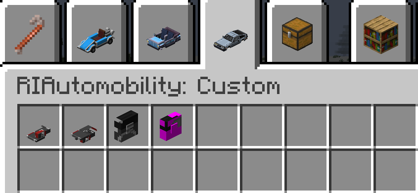
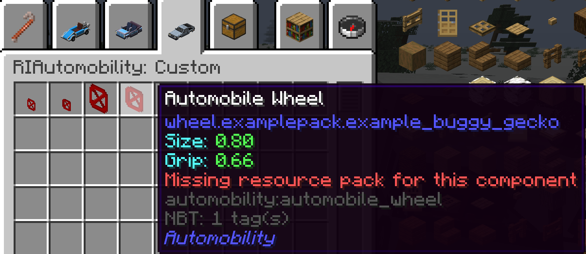

# RIAutomobility

<div align="center">

[](https://www.minecraft.net/)
[](https://files.minecraftforge.net/)
[](LICENSE.txt)

**A Forge addon for Automobility — expanding vehicles with custom frames, wheels, multi-seat support, and datapack-driven content.**

[English](#english) | [中文](#中文)

</div>

---

## English

### Table of Contents

- [Overview](#overview)
- [Features](#features)
- [Dependencies](#dependencies)
- [Built-in Content](#built-in-content)
- [Installation](#installation)
- [Data-Driven Guide](#data-driven-guide)
- [Example Pack](#example-pack)
- [Notes for Pack Authors](#notes-for-pack-authors)

### Overview

`RIAutomobility` is a Forge addon for `Automobility` on Minecraft `1.20.1`. It extends the base mod with new vehicle components and powerful customization tools for both players and content creators.

Whether you want to drive new vehicles out of the box or design your own through datapacks and resource packs, RIAutomobility has you covered.

### Features

- **New Vehicle Components** — Multiple custom frames and wheels built on top of Automobility
- **Multi-Seat Vehicles** — Custom seat layouts for larger or special vehicles
- **Custom Hitboxes & Camera** — Fine-tuned collision and camera definitions for RIA vehicles
- **Organized Creative Tabs** — Built-in and datapack components are neatly separated:
  - `RIAutomobility` — built-in frames and wheels
  - `RIAutomobility: Custom` — datapack-defined components
- **Datapack Support** — Define custom `Frame` and `Wheel` components via JSON
- **Dual Rendering Pipelines** — Supports both `JsonEM` baked models and `GeckoLib` animated models
- **Safe Fallbacks** — Missing resources render as a placeholder with tooltip warnings instead of crashing

### Dependencies

| Mod | Version |
|-----|---------|
| Minecraft | `1.20.1` |
| Forge | `47.1.x` |
| [Automobility](https://www.curseforge.com/minecraft/mc-mods/automobility) | `0.4.2+1.20.1-forge` |
| [GeckoLib](https://www.curseforge.com/minecraft/mc-mods/geckolib) | `4.x` |

### Built-in Content

The mod ships with a variety of pre-made vehicles and components:

**Double Motorcars**
- Wooden, Copper, Steel, Golden, Bejeweled

**Quad Motorcars**
- Wooden, Copper, Steel, Golden, Bejeweled

**Special Vehicles**
- Lorry (with container support)
- DMC12
- Standard Formula

**Wheels**
- Matching custom wheels for DMC12 and Standard Formula

### Installation

#### For Players

1. Install [Forge](https://files.minecraftforge.net/) for Minecraft 1.20.1
2. Download and install **Automobility** and **GeckoLib**
3. Place `RIAutomobility.jar` in your `mods/` folder
4. Launch the game

#### For Custom Content (Datapacks)

1. Place your datapack in the world's `datapacks/` folder
2. Place your resource pack in Minecraft's `resourcepacks/` folder
3. Enable the resource pack in-game
4. Enter the world and run `/reload` if needed

### Data-Driven Guide

Custom components are split into two parts:

| Part | Purpose |
|------|---------|
| **Datapack** | Gameplay definition (stats, dimensions, seats, hitboxes, model references) |
| **Resource Pack** | Model, texture, and animation assets |

#### Datapack Paths

```
data/<namespace>/riautomobility/frames/<id>.json
data/<namespace>/riautomobility/wheels/<id>.json
```

Optional Automobility recipes:
```
data/automobility/recipes/frame/<recipe>.json
data/automobility/recipes/wheel/<recipe>.json
```

#### Resource Pack Paths

**JsonEM models:**
```
assets/<namespace>/models/entity/automobile/frame/<name>/main.json
assets/<namespace>/models/entity/automobile/wheel/<name>/main.json
```

**GeckoLib models:**
```
assets/<namespace>/geo/...
assets/<namespace>/animations/...
assets/<namespace>/textures/...
```

**Translations:**
```
assets/<namespace>/lang/en_us.json
assets/<namespace>/lang/zh_cn.json
```

#### Frame JSON Format

Example frame definition:

```json
{
  "weight": 0.85,
  "model": {
    "type": "jsonem",
    "texture": "examplepack:textures/entity/automobile/frame/example_buggy.png",
    "model_id": "examplepack:frame_example_buggy",
    "layer_location": "examplepack:automobile/frame/example_buggy",
    "render_type": "entity_cutout",
    "rotation_y": 0.0
  },
  "wheel_base": {
    "forward_separation": 44.0,
    "side_separation": 26.0
  },
  "length_px": 44.0,
  "seat_height": 4.0,
  "engine_pos_back": 14.0,
  "engine_pos_up": 3.0,
  "rear_attachment_pos": 18.0,
  "front_attachment_pos": 18.0,
  "dimensions": {
    "width": 1.75,
    "height": 0.95
  },
  "seats": [
    { "x": 0.35, "y": 0.0, "z": 0.05 },
    { "x": -0.35, "y": 0.0, "z": 0.05 }
  ],
  "camera_positions": [
    { "x": -3.0, "y": 0.5, "z": 0.0 }
  ],
  "hitboxes": [
    { "x": 0.0, "y": 0.0, "z": 0.65, "width": 1.65, "height": 0.95, "container": false }
  ],
  "front_attachment_enabled": false,
  "rear_attachment_enabled": false,
  "show_in_creative_tab": true
}
```

**Field Reference:**

| Field | Description |
|-------|-------------|
| `weight` | Frame weight |
| `model` | Rendering definition (see [Model Types](#model-definition-types)) |
| `wheel_base` | Wheel layout (symmetric or per-wheel) |
| `length_px` | Frame render length in pixels |
| `seat_height` | Base seat height in pixels |
| `engine_pos_back` / `engine_pos_up` | Engine position on Z / Y axis in pixels |
| `rear_attachment_pos` / `front_attachment_pos` | Attachment anchor positions in pixels |
| `dimensions.width` / `dimensions.height` | Entity dimensions in blocks |
| `seats` | Seat positions in block coordinates |
| `camera_positions` | Camera offsets in block coordinates |
| `hitboxes` | Custom hitbox definitions |
| `front_attachment_enabled` / `rear_attachment_enabled` | Allow attachments |
| `show_in_creative_tab` | Show in the RIA creative tab |

**Wheel Base Formats:**

Simple symmetric layout:
```json
"wheel_base": {
  "forward_separation": 44.0,
  "side_separation": 26.0
}
```

Custom per-wheel layout:
```json
"wheel_base": {
  "wheels": [
    { "forward": 22.0, "right": -13.0, "scale": 1.0, "yaw": 0.0, "end": "front", "side": "left" },
    { "forward": -22.0, "right": -13.0, "scale": 1.0, "yaw": 0.0, "end": "back", "side": "left" },
    { "forward": 22.0, "right": 13.0, "scale": 1.0, "yaw": 180.0, "end": "front", "side": "right" },
    { "forward": -22.0, "right": 13.0, "scale": 1.0, "yaw": 180.0, "end": "back", "side": "right" }
  ]
}
```

#### Wheel JSON Format

Example wheel definition:

```json
{
  "size": 0.78,
  "grip": 0.62,
  "radius": 5.0,
  "width": 3.5,
  "model": {
    "type": "jsonem",
    "texture": "examplepack:textures/entity/automobile/wheel/example_buggy.png",
    "model_id": "examplepack:wheel_example_buggy",
    "layer_location": "examplepack:automobile/wheel/example_buggy",
    "render_type": "entity_cutout",
    "rotation_y": -90.0
  },
  "show_in_creative_tab": true
}
```

**Field Reference:**

| Field | Description |
|-------|-------------|
| `size` | Wheel size (Automobility logic) |
| `grip` | Grip value |
| `radius` / `width` | Model dimensions in pixels |
| `model` | Rendering definition |
| `show_in_creative_tab` | Show in the RIA creative tab |

<!-- TODO: Replace with actual screenshot -->
<div align="center">
  
  <br>
  <em>Figure 1: Custom frame and wheel defined via datapack, shown in the creative tab</em>
</div>

#### Model Definition Types

**JsonEM** — Baked JSON entity model:

```json
"model": {
  "type": "jsonem",
  "texture": "examplepack:textures/entity/automobile/frame/example_buggy.png",
  "model_id": "examplepack:frame_example_buggy",
  "layer_location": "examplepack:automobile/frame/example_buggy",
  "render_type": "entity_cutout",
  "rotation_y": 0.0
}
```

- `render_type`: `entity_cutout` | `entity_cutout_no_cull` | `entity_translucent` | `entity_translucent_cull` | `entity_solid`

**GeckoLib** — Animated geo model:

```json
"model": {
  "type": "geckolib",
  "texture": "examplepack:textures/entity/automobile/frame/example_buggy.png",
  "model_id": "examplepack:frame_example_buggy_gecko",
  "geo_model": "examplepack:geo/frame/example_buggy.geo.json",
  "animation": "examplepack:animations/example_buggy.animation.json"
}
```

#### Recipe Example

```json
{
  "type": "automobility:auto_mechanic_table",
  "category": "automobility:frames",
  "sortnum": 200,
  "ingredients": [
    { "item": "automobility:automobile_frame", "component": "automobility:standard_red" },
    { "item": "minecraft:iron_ingot" }
  ],
  "result": {
    "item": "automobility:automobile_frame",
    "component": "examplepack:example_buggy"
  }
}
```

### Example Pack

A complete minimal example is included in this repository:

- [`examples/examplepack-data/`](examples/examplepack-data/)
- [`examples/examplepack-resources/`](examples/examplepack-resources/)
- [`examples/examplepack/README.md`](examples/examplepack/README.md)

It contains:
- A `JsonEM` frame and wheel example
- A `GeckoLib` frame and wheel example
- Matching recipes, translations, and resource-pack model files


### Notes for Pack Authors

- Datapacks can define components without resource packs, but they will render as placeholders.
- Missing-resource placeholders use a barrier texture for easy identification.
- `JsonEM` components need valid `assets/<namespace>/models/entity/.../main.json` files.
- `GeckoLib` components need valid `geo`, `animation`, and texture resources.
- Tooltips warn the player when the required resource pack is missing.
- Custom models apply automatically after joining the world — no `F3 + T` needed.

<!-- TODO: Replace with actual screenshot -->
<div align="center">
  
  <br>
  <em>Figure 2: Placeholder model and tooltip warning when a resource pack is missing</em>
</div>

---

## 中文

### 目录

- [模组简介](#模组简介)
- [主要功能](#主要功能)
- [依赖](#依赖)
- [内置内容](#内置内容)
- [安装方法](#安装方法)
- [数据驱动教程](#数据驱动教程)
- [示例包](#示例包)
- [给内容作者的提示](#给内容作者的提示)

### 模组简介

`RIAutomobility` 是一个基于 Minecraft `1.20.1 Forge` 的 `Automobility` 附属模组。它在 Automobility 的基础上扩展了新的车辆组件，并为玩家和内容创作者提供了强大的自定义工具。

无论你是想直接使用内置新车，还是通过数据包和资源包设计自己的载具，RIAutomobility 都能满足你的需求。

### 主要功能

- **全新车辆部件** — 为 Automobility 添加了多种自定义车架和车轮
- **多座位载具** — 为大型或特殊车型提供自定义座位布局
- **自定义碰撞箱与摄像机** — 为 RIA 车辆提供精细调整的碰撞箱和摄像机定义
- **分类创造标签页** — 内置组件与数据包组件分类管理：
  - `飞天奇匠` — 内置车架与车轮
  - `飞天奇匠：自定义` — 数据包定义的组件
- **数据包支持** — 通过 JSON 定义自定义 `Frame` / `Wheel`
- **双渲染管线** — 同时支持 `JsonEM` 烘焙模型和 `GeckoLib` 动画模型
- **安全降级** — 资源缺失时使用占位模型并提示，不会导致崩溃

### 依赖

| 模组 | 版本 |
|------|------|
| Minecraft | `1.20.1` |
| Forge | `47.1.x` |
| [Automobility](https://www.curseforge.com/minecraft/mc-mods/automobility) | `0.4.2+1.20.1-forge` |
| [GeckoLib](https://www.curseforge.com/minecraft/mc-mods/geckolib) | `4.x` |

### 内置内容

模组内置了多种预制车辆和部件：

**双座汽车系列**
- 木质、铜质、钢质、黄金、璀璨

**四座汽车系列**
- 木质、铜质、钢质、黄金、璀璨

**特殊车辆**
- 大运（带集装箱支持）
- DMC12
- 标准方程式

**车轮**
- DMC12 和标准方程式专用车轮

### 安装方法

#### 普通玩家

1. 安装适用于 Minecraft 1.20.1 的 [Forge](https://files.minecraftforge.net/)
2. 下载并安装 **Automobility** 和 **GeckoLib**
3. 将 `RIAutomobility.jar` 放入 `mods/` 文件夹
4. 启动游戏

#### 自定义内容（数据包）

1. 将数据包放入存档的 `datapacks/` 文件夹
2. 将资源包放入 Minecraft 的 `resourcepacks/` 文件夹
3. 在游戏中启用资源包
4. 进入存档，如需可执行 `/reload`

### 数据驱动教程

自定义车辆组件分为两部分：

| 部分 | 作用 |
|------|------|
| **数据包** | 玩法定义（数值、尺寸、座位、碰撞箱、模型引用） |
| **资源包** | 模型、贴图、动画资源 |

#### 数据包路径

```
data/<命名空间>/riautomobility/frames/<id>.json
data/<命名空间>/riautomobility/wheels/<id>.json
```

可选的 Automobility 配方：
```
data/automobility/recipes/frame/<配方>.json
data/automobility/recipes/wheel/<配方>.json
```

#### 资源包路径

**JsonEM 模型：**
```
assets/<命名空间>/models/entity/automobile/frame/<名称>/main.json
assets/<命名空间>/models/entity/automobile/wheel/<名称>/main.json
```

**GeckoLib 模型：**
```
assets/<命名空间>/geo/...
assets/<命名空间>/animations/...
assets/<命名空间>/textures/...
```

**翻译文件：**
```
assets/<命名空间>/lang/en_us.json
assets/<命名空间>/lang/zh_cn.json
```

#### Frame JSON 格式

车架定义示例：

```json
{
  "weight": 0.85,
  "model": {
    "type": "jsonem",
    "texture": "examplepack:textures/entity/automobile/frame/example_buggy.png",
    "model_id": "examplepack:frame_example_buggy",
    "layer_location": "examplepack:automobile/frame/example_buggy",
    "render_type": "entity_cutout",
    "rotation_y": 0.0
  },
  "wheel_base": {
    "forward_separation": 44.0,
    "side_separation": 26.0
  },
  "length_px": 44.0,
  "seat_height": 4.0,
  "engine_pos_back": 14.0,
  "engine_pos_up": 3.0,
  "rear_attachment_pos": 18.0,
  "front_attachment_pos": 18.0,
  "dimensions": {
    "width": 1.75,
    "height": 0.95
  },
  "seats": [
    { "x": 0.35, "y": 0.0, "z": 0.05 },
    { "x": -0.35, "y": 0.0, "z": 0.05 }
  ],
  "camera_positions": [
    { "x": -3.0, "y": 0.5, "z": 0.0 }
  ],
  "hitboxes": [
    { "x": 0.0, "y": 0.0, "z": 0.65, "width": 1.65, "height": 0.95, "container": false }
  ],
  "front_attachment_enabled": false,
  "rear_attachment_enabled": false,
  "show_in_creative_tab": true
}
```

**字段说明：**

| 字段 | 说明 |
|------|------|
| `weight` | 车架重量 |
| `model` | 渲染定义（详见 [模型类型](#模型定义类型)） |
| `wheel_base` | 轮组布局（对称简写或逐轮定义） |
| `length_px` | 渲染长度，单位像素 |
| `seat_height` | 座位基准高度，单位像素 |
| `engine_pos_back` / `engine_pos_up` | 引擎在 Z / Y 轴位置，单位像素 |
| `rear_attachment_pos` / `front_attachment_pos` | 挂载锚点位置，单位像素 |
| `dimensions.width` / `dimensions.height` | 实体尺寸，单位方块 |
| `seats` | 座位坐标，单位方块 |
| `camera_positions` | 摄像机偏移，单位方块 |
| `hitboxes` | 自定义碰撞箱定义 |
| `front_attachment_enabled` / `rear_attachment_enabled` | 是否允许挂件 |
| `show_in_creative_tab` | 是否在 RIA 创造标签页显示 |

**wheel_base 写法：**

对称简写：
```json
"wheel_base": {
  "forward_separation": 44.0,
  "side_separation": 26.0
}
```

逐轮自定义：
```json
"wheel_base": {
  "wheels": [
    { "forward": 22.0, "right": -13.0, "scale": 1.0, "yaw": 0.0, "end": "front", "side": "left" },
    { "forward": -22.0, "right": -13.0, "scale": 1.0, "yaw": 0.0, "end": "back", "side": "left" },
    { "forward": 22.0, "right": 13.0, "scale": 1.0, "yaw": 180.0, "end": "front", "side": "right" },
    { "forward": -22.0, "right": 13.0, "scale": 1.0, "yaw": 180.0, "end": "back", "side": "right" }
  ]
}
```

#### Wheel JSON 格式

车轮定义示例：

```json
{
  "size": 0.78,
  "grip": 0.62,
  "radius": 5.0,
  "width": 3.5,
  "model": {
    "type": "jsonem",
    "texture": "examplepack:textures/entity/automobile/wheel/example_buggy.png",
    "model_id": "examplepack:wheel_example_buggy",
    "layer_location": "examplepack:automobile/wheel/example_buggy",
    "render_type": "entity_cutout",
    "rotation_y": -90.0
  },
  "show_in_creative_tab": true
}
```

**字段说明：**

| 字段 | 说明 |
|------|------|
| `size` | Automobility 逻辑使用的轮子尺寸 |
| `grip` | 抓地力 |
| `radius` / `width` | 模型尺寸，单位像素 |
| `model` | 渲染定义 |
| `show_in_creative_tab` | 是否在 RIA 创造标签页显示 |

<!-- TODO: 替换为实际截图 -->
<div align="center">
  
  <br>
  <em>图 1：通过数据包定义的自定义车架和车轮在创造标签页中的展示</em>
</div>

#### 模型定义类型

**JsonEM** — 适用于烘焙 JSON 实体模型：

```json
"model": {
  "type": "jsonem",
  "texture": "examplepack:textures/entity/automobile/frame/example_buggy.png",
  "model_id": "examplepack:frame_example_buggy",
  "layer_location": "examplepack:automobile/frame/example_buggy",
  "render_type": "entity_cutout",
  "rotation_y": 0.0
}
```

- `render_type`: `entity_cutout` | `entity_cutout_no_cull` | `entity_translucent` | `entity_translucent_cull` | `entity_solid`

**GeckoLib** — 适用于 GeckoLib 动画模型：

```json
"model": {
  "type": "geckolib",
  "texture": "examplepack:textures/entity/automobile/frame/example_buggy.png",
  "model_id": "examplepack:frame_example_buggy_gecko",
  "geo_model": "examplepack:geo/frame/example_buggy.geo.json",
  "animation": "examplepack:animations/example_buggy.animation.json"
}
```

#### 配方示例

```json
{
  "type": "automobility:auto_mechanic_table",
  "category": "automobility:frames",
  "sortnum": 200,
  "ingredients": [
    { "item": "automobility:automobile_frame", "component": "automobility:standard_red" },
    { "item": "minecraft:iron_ingot" }
  ],
  "result": {
    "item": "automobility:automobile_frame",
    "component": "examplepack:example_buggy"
  }
}
```

### 示例包

仓库中已附带一套完整的最小示例：

- [`examples/examplepack-data/`](examples/examplepack-data/)
- [`examples/examplepack-resources/`](examples/examplepack-resources/)
- [`examples/examplepack/README.md`](examples/examplepack/README.md)

其中包含：
- 一套 `JsonEM` 车架与车轮示例
- 一套 `GeckoLib` 车架与车轮示例
- 对应配方、翻译文件和资源包模型

### 给内容作者的提示

- 只装数据包不装资源包也是允许的，但组件会显示为占位模型。
- 缺失资源时，占位模型使用屏障贴图，方便在物品栏中识别。
- `JsonEM` 组件需要正确的 `assets/<命名空间>/models/entity/.../main.json`。
- `GeckoLib` 组件需要正确的 `geo`、`animation` 和贴图资源。
- 当资源缺失时，tooltip 会提示玩家缺少对应资源包。
- 自定义模型在进入世界后自动生效，通常不需要按 `F3 + T`。

<!-- TODO: 替换为实际截图 -->
<div align="center">
  
  <br>
  <em>图 2：当资源包缺失时显示的占位模型与 Tooltip 警告</em>
</div>
